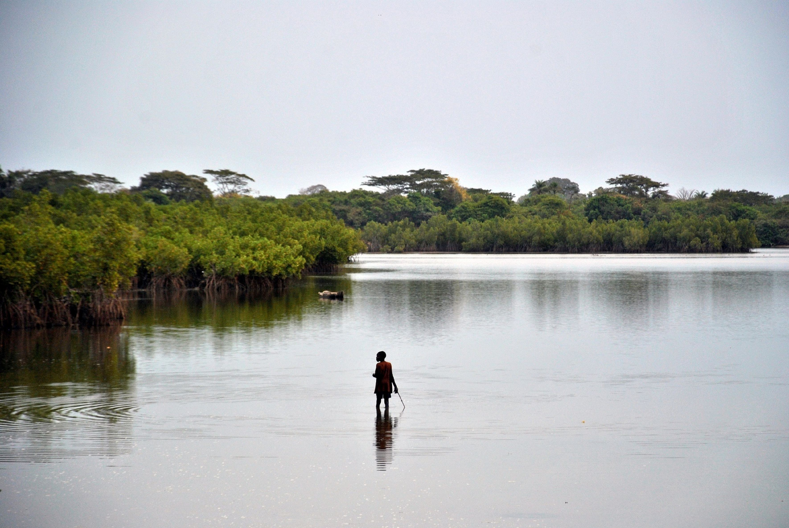

### Team Members 

- [Clarissa Boyajian](https://github.com/cboyajian) Clarissa is a certified arborist with experience using urban forestry tree canopy coverage in project and grant management. 

- [Allie Cole](https://github.com/AllieCole)
Allie has spent a large amount of time working in and around mangrove ecosystems, and has a degree in marine science. She is currently working with Spatial Analysis tools at UCSB. icole@bren.ucsb.edu 
- [Scout Leonard](https://github.com/scoutcleonard) Scout has completed coursework in Plant Systematics and Plant Biology. She is currently learning Spatial Analysis at UCSB.

### Mangrove Canopy Cover

Our team's project calculates 3 canopy coverage indices for the Cacheu Park Mangrove Forest in Guinea-Bissau using Landsat 8 data from before and after mangrove restoration efforts were implemented.

The repository for this analysis and the materials we used to create our indices and teach them to our cohort can be found in our [final project repository.](https://github.com/mc-cover/Gee_Whiz_Final_Project)