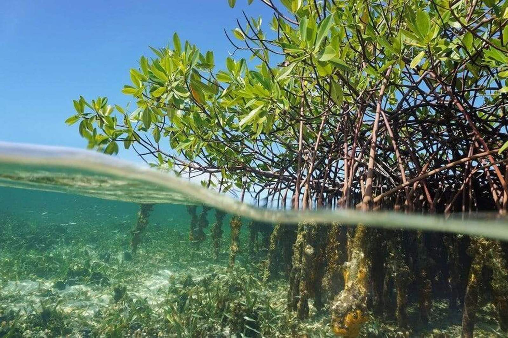

```{r setup, include=FALSE}
knitr::opts_chunk$set(echo = TRUE)
```

Welcome to our group project website! 

To learn more about our spatial analysis project and team, please visit the ["About" page.](https://mc-cover.github.io/about.html)




